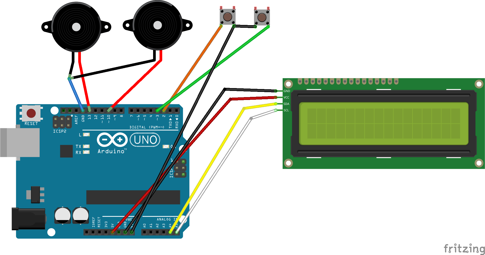

# ProtoStaxEndlessRunnerGame

An Arduino-based Endless Runner Game with Background Music and Sound
Effects in a Portable Game Console!


Guide the Runner (Harry Potter (with his wand)?!), jumping over and
avoiding the obstacles (Trees in the Forbidden Forest?!).

Press Button1 to start the game. During gameplay, press Button1 to jump
and avoid obstacles. The game stops when the Runner (Harry Potter?!) runs into an obstacle (Trees in a forest). 
Points are awarded based on distance. The game tracks and displays the
high score.

Pressing Button2 when the play is in progress loops through Background themes - there are 
three themes currently - Harry Potter, Game of Thrones and Legend of
Zelda, so you can pick your favorite theme (or program in your own
theme music using the user-friendly MML notation)! You also have sound effects
when the Runner jumps, or when the Runner hits an obstacle and the game ends. 

Adapted from "Arduino LCD Game" by Joshua Brooks
(http://www.instructables.com/member/joshua.brooks/)

This example uses the setup of the [ProtoStax Portable Arduino Game
Console](https://github.com/protostax/ProtoStax_Portable_Arduino_Game_Console) - please refer to that for parts, instructions and wiring.


## Prerequisites

This demo uses
* [ProtoStax for Arduino](https://www.protostax.com/products/protostax-for-arduino)
* [ProtoStax LCD Kit V2](https://www.protostax.com/products/protostax-lcd-kit-v2)
* [ProtoStax Kit for Momentary Push Button Switches](https://www.protostax.com/products/protostax-kit-for-momentary-push-button-switches)
* Arduino (Uno)
* Piezo buzzers PS1240 x 2
* Jumper wires



For further instructions, see the [Portable Arduino Game Console - Part 1 - Endless Runner](https://www.hackster.io/sridhar-rajagopal/portable-arduino-game-console-part-1-endless-runner-7a6019)
Tutorial at
[Hackster.io](https://www.hackster.io/sridhar-rajagopal/portable-arduino-game-console-part-1-endless-runner-7a6019)

## Installing

This demo uses the following libraries:

* [MmlMusic](https://github.com/maxint-rd/MmlMusic)
* [ProtoStax_MmlMusicPlayer](https://github.com/protostax/ProtoStax_MmlMusicPlayer)
* LiquidCrystal_I2C
* JC_Button

```
Arduino IDE->Sketch->Include LIbrary->Manage Libraries - choose
JC_Button and install it
Arduino IDE->Sketch->Include LIbrary->Manage Libraries - choose
LiquidCrystal_I2C and install it
Install MmlMusic from GitHub (see link above)
Install ProtoStax_MmlMusicPlayer from GitHub (see link above)
```

Get the source code
```
git clone https://github.com/protostax/ProtoStax_Portable_Arduino_Game_Console.git
```

## Usage

See instructions in Tutorial linked above for putting together the circuit and
enclosure. 

```
open
ProtoStaxEndlessRunnerGame/ProtoStaxEndlessRunnerGame.ino in
Arduino IDE
compile sketch and upload to your Arduino
```

Enjoy!

## License

Written by Sridhar Rajagopal for ProtoStax. BSD license, all text above must be included in any redistribution

A lot of time and effort has gone into providing this and other code. Please support ProtoStax by purchasing products from us!

